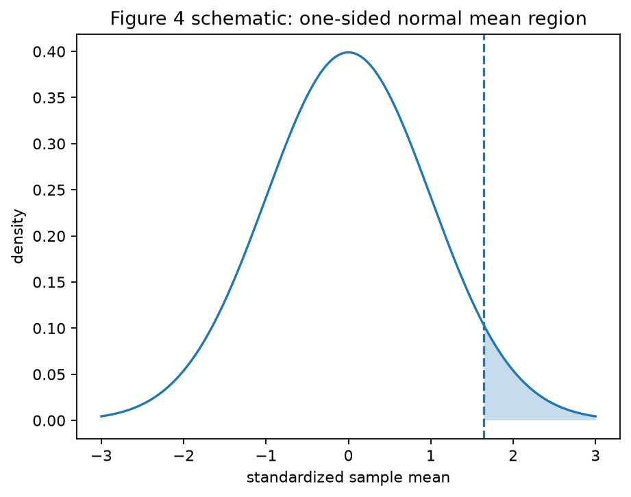
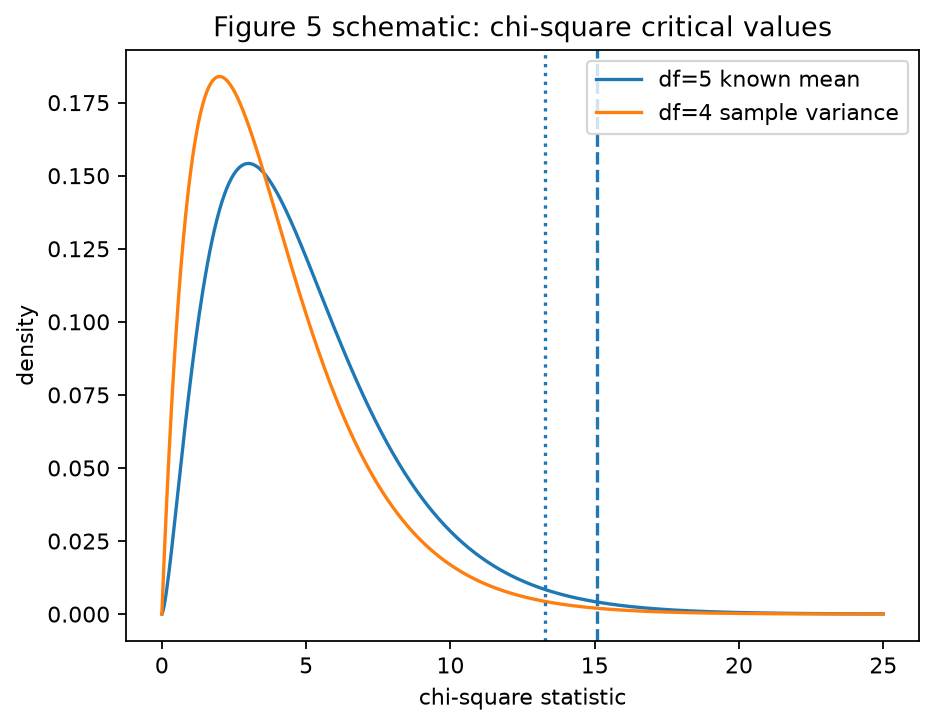
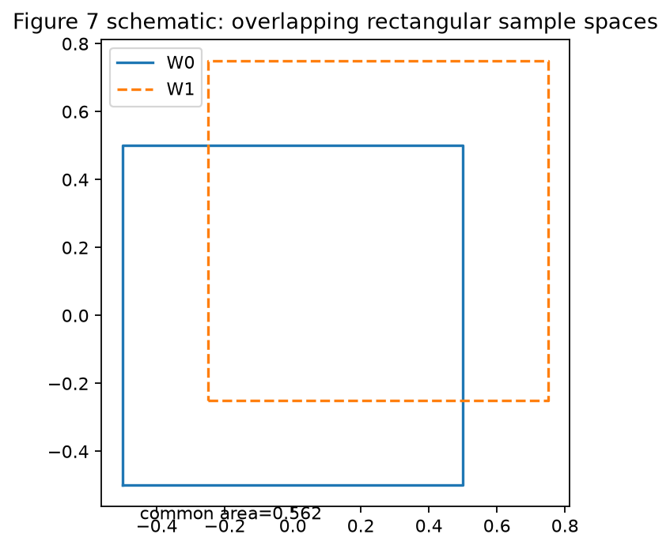
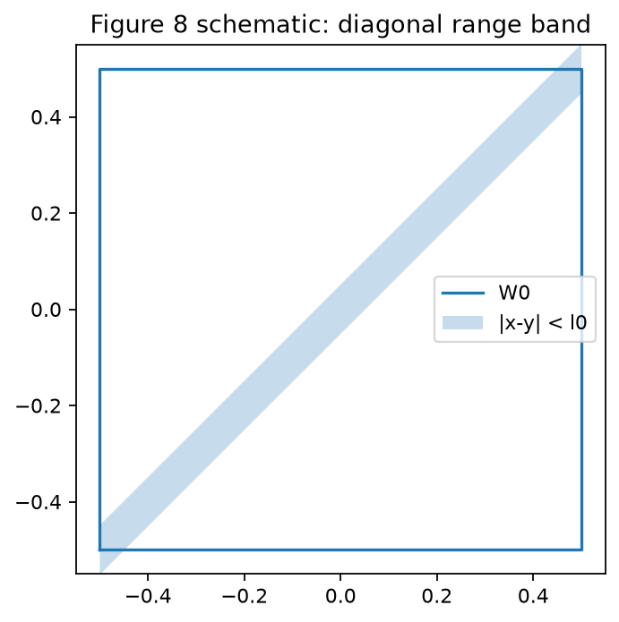
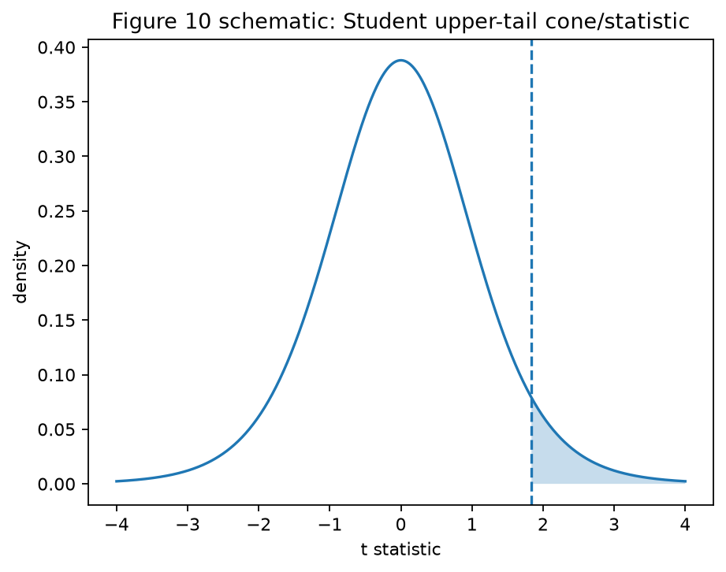

# Artifacts

This page describes the distributed source material and the generated public artifacts.

## Source And Audit Material

- `data/raw/paper_ocr.txt`: distributed OCR text source for the relevant paper sections.
- `data/raw/paper_pdf.pdf`: optional local input for manual OCR cross-checking. This file is not bundled.
- `data/interim/referenced_equations.csv`: corrected equation registry for equations used by implemented examples, figures, and validation checks.

## Generated Tables

### `outputs/tables/critical_values.csv`

This table contains all numeric result rows produced by `scripts/reproduce_examples.py`:

- Example 1 one-sided normal critical value;
- Example 2 chi-square critical values;
- Example 2 acceptance probabilities under variance alternatives;
- Example 8 Student critical value;
- Example 9 chi-square critical values with unknown mean;
- Example 10 F and beta critical values;
- Example 11 two-sample Student critical value.

The columns `paper_value`, `paper_rounding_digits`, `computed_value`, `abs_error`, and `rounding_match` distinguish paper-rounded targets from exact modern computations.

### `outputs/tables/power_values.csv`

This table is the subset of numeric rows with a non-null `alternative_probability`. In the current repository it records the Example 2 acceptance-probability comparison for `sigma_1 = h sigma_0`.

### `outputs/tables/geometry_checks.csv`

This table contains the deterministic geometry checks for Examples 4-6. The rows are schematic and are intended to validate area relationships, not to claim an exact historical drawing reconstruction.

### `outputs/tables/figure_inventory.csv`

This table lists Figures 1-10, whether each figure is generated in the repository, the repo-relative `path` for implemented figures, the linked example and equation identifiers, and a short `description`.

Implemented figure paths use repo-relative forward-slash form such as `outputs/figures/fig04.png`.

## Generated Figures

### Figure 4

- paper object: one-sided normal mean test illustration;
- generator: `generate_figure("fig04")` or `scripts/make_figures.py`;
- output: `outputs/figures/fig04.png`;
- status: `schematic_geometry`.

### Figure 5

- paper object: chi-square critical-value comparison for Example 2;
- generator: `generate_figure("fig05")` or `scripts/make_figures.py`;
- output: `outputs/figures/fig05.png`;
- status: `schematic_geometry`.

### Figure 7

- paper object: rectangular-population overlap geometry;
- generator: `generate_figure("fig07")` or `scripts/make_figures.py`;
- output: `outputs/figures/fig07.png`;
- status: `schematic_geometry`.

### Figure 8

- paper object: diagonal range-band geometry;
- generator: `generate_figure("fig08")` or `scripts/make_figures.py`;
- output: `outputs/figures/fig08.png`;
- status: `schematic_geometry`.

### Figure 10

- paper object: Student upper-tail illustration for Example 8;
- generator: `generate_figure("fig10")` or `scripts/make_figures.py`;
- output: `outputs/figures/fig10.png`;
- status: `schematic_geometry`.

No pixel-exact historical reproduction is claimed for any of these figures.

## Validation Artifact

`outputs/logs/validation_summary.json` is written by `scripts/validate.py`. It records the pass/fail state and detail payload for source, schema, linkage, numeric, and artifact checks. See `docs/validation.md` for the meaning of each check.
